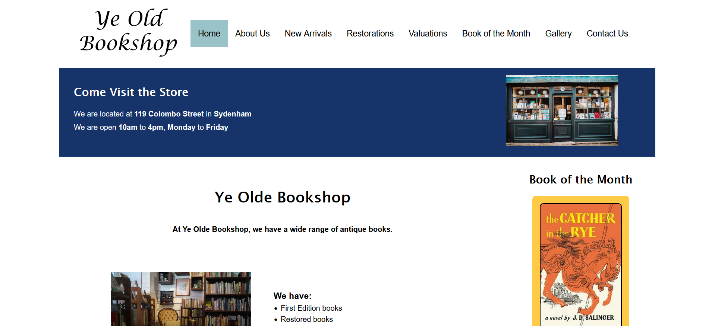

# Ye Olde Bookshoppe

[View Live](https://yeoldebookshoppe.flynnp4yne.com/)

Ye Olde Bookshoppe is a website created for an assignment at Ara Institute of Canterbury. I had to write up a specifications document which included topics like goals and objectives, target audience, user interaction, scope and SEO. I also had to create prototypes and then build the website in HTML and CSS.

## Grades
I got a grade of 89.5% for this project and an A+ overall for the class.

## Languages
+ HTML and CSS
+ JavaScript

## License

[MIT](https://choosealicense.com/licenses/mit/)